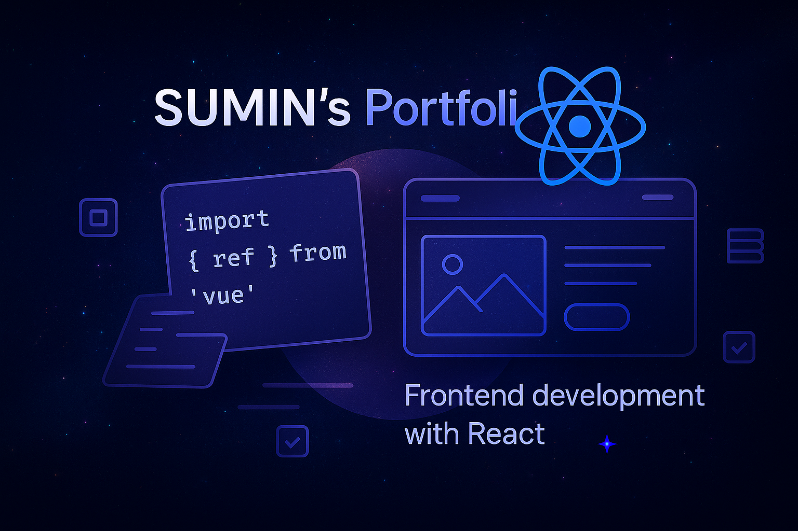

# Sumin's Portfolio



## 💻 프로젝트 소개

**개발자 노수민의 포트폴리오 웹사이트**

- Next.js와 Framer Motion을 활용한 인터랙티브한 포트폴리오 웹사이트
- 반응형 디자인으로 모든 디바이스에서 최적화된 경험 제공
- 애니메이션과 인터랙션을 통한 역동적인 사용자 경험
- 블로그 섹션을 통한 기술 공유 및 기록

🔗 [포트폴리오 사이트](https://sumin.it.kr/)

### 📆 작업 기간

- 개발 기간: 2025.05.13 ~ 진행중

<br />

## ⚙️ 주요 기능

### 🎨 인터랙티브 UI/UX

**- 스크롤 기반 애니메이션**

> Framer Motion을 활용한 부드러운 스크롤 애니메이션
> 요소별 등장 효과와 전환 애니메이션
> 스크롤 위치에 따른 헤더 스타일 변경

**- 반응형 디자인**

> 모든 디바이스에서 최적화된 레이아웃
> 모바일 퍼스트 접근 방식
> 유동적인 그리드 시스템

### 📝 섹션 구성

**- 인트로 섹션**

> 간단한 자기소개와 핵심 가치 소개
> 스크롤 기반 애니메이션으로 자연스러운 전환

**- 기술 스택 섹션**

> 프론트엔드 기술 분류
> 실제 프로젝트에서 활용한 기술 중심
> 각 기술의 활용 경험 설명

**- 경력 섹션**

> 직무 경력 사항
> 주요 프로젝트 및 성과
> 카드 형식의 시각화

**- 블로그 섹션**

> 기술 관련 포스팅
> 프로젝트 회고 및 트러블슈팅
> 최신 포스트 하이라이트

**- 프로젝트 섹션**

> 주요 프로젝트 하이라이트
> 프로젝트별 상세 정보 및 기술 스택
> GitHub 저장소 및 데모 링크 연결

**- 연락처 섹션**

> 이메일 및 소셜 미디어 링크
> GitHub 프로필 연결
> 연락 가능한 채널 안내

<br />

## 🧰 기술 스택

<div align="left">

### 패키지 매니저


### 프레임워크 및 라이브러리


### 상태 관리


### 배포 및 CI


### 버전 관리 도구


<br />

## 📁 프로젝트 구조

```markdown
📁sumin-portfolio
├── public/ # 정적 파일
│ ├── images/ # 이미지 에셋
│ └── fonts/ # 폰트 파일
│
├── src/
│ ├── app/ # Next.js 14+ App Router
│ │ ├── projects/ # 프로젝트 상세 페이지
│ │ ├── page.client.tsx # 클라이언트 컴포넌트
│ │ ├── page.tsx # 메인 페이지
│ │ └── layout.tsx # 루트 레이아웃
│ │
│ ├── components/
│ │ ├── layout/ # 레이아웃 컴포넌트 (Header 등)
│ │ ├── sections/ # 메인 섹션 컴포넌트
│ │ │ ├── IntroSection.tsx
│ │ │ ├── SkillsSection.tsx
│ │ │ ├── ExperienceSection.tsx
│ │ │ ├── ProjectSection.tsx
│ │ │ ├── BlogSection.tsx
│ │ │ └── ContactSection.tsx
│ │ └── ui/ # 재사용 가능한 UI 컴포넌트
│ │
│ ├── lib/ # 유틸리티 함수
│ ├── hooks/ # 커스텀 훅
│ ├── store/ # Zustand 스토어
│ ├── types/ # TypeScript 타입 정의
│ └── constants/ # 상수 정의
└── ...
```

## 🚀 트러블 슈팅

- [포트폴리오를 만들다 만난 JIT](https://velog.io/@sum529/Trouble-Shooting-포트폴리오를-만들다-만난-JIT)

  > Next.js 빌드 시 JIT 컴파일러 관련 이슈와 해결 과정

- [모바일에서 애니메이션이 안 꺼지는 이유](https://velog.io/@sum529/Trouble-Shooting-모바일에서-애니메이션이-안-꺼지는-이유)

  > 모바일 환경에서 Framer Motion 애니메이션 최적화 문제

- [뒤로가기 후 스크롤 동작이 다시 실행되는 문제](https://velog.io/@sum529/Trouble-Shooting-뒤로가기-후-스크롤-동작이-다시-실행되는-문제)
  > 브라우저 히스토리 관리와 스크롤 이벤트 처리 개선
